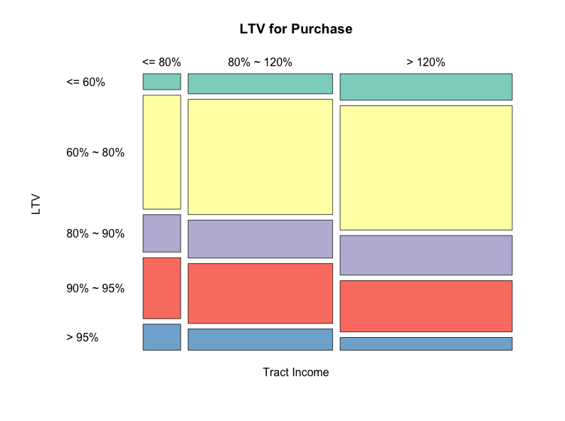
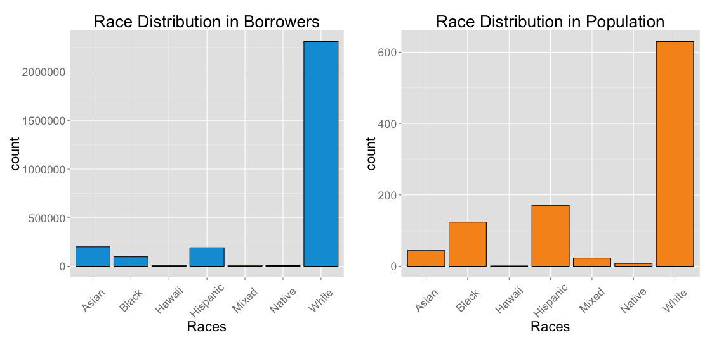

Business is the art about collaboration and leverage --- leveraging other 
people's time, work, effort, experiences and knowledge. 
As a business owner, you deal with a lot of customers. You
want to delelop some kind of "payment" plans for your 
customers so that you will have more potential customers, 
and you will gain a competing edge compared with your competitors. 
This study to to help you to learn the lending model
used by the industry leader --- [Fannie Mae](http://www.fanniemae.com/portal/index.html).

To learn from the data, we will perform the following three steps:

* exploring the data --- to learn what it is
* focus on the informative features --- to figure out why it is
* build models to explain the data --- generalize to other problems

We will perform these steps to the 2013 mortgage data 
of `high cost single families` and `low income owner-occupied single families`.
The size of the files studied in this report is about 1 GB.

## How Many Loans does Fannie Mae have?

The loan data is from [Federal Housing Finance Agency](http://www.fhfa.gov/DataTools/Downloads/Pages/Public-Use-Databases.aspx), and the geographical data of all the `US tracts` is from [US Census](http://www.census.gov/geo/maps-data/data/gazetteer.html). 
Combining these two, here I show the distribution of all the tracts, and
the distribution of the loans across the US. 

* Detail: due to the file sizes, I did data munging using `Python`, by extracting and converting the `county code` and `tract code` into the same format. 
* The files are then read into `R`. The files are merged and the graphs are plotted in `R`.

### Load in data
```r
setwd('/Users/dwang/DATA')
areas = read.table("serv2009_first7.txt", header=TRUE); areas = data.frame(areas)
ustracts = read.table("ustracts2k.txt", header = FALSE)
colnames(ustracts) = c("AllCodes", "Pop", "HousingU", "Land", "Water", "Land2", "Water2", "Latitude", "Longitude");ustracts = data.frame(ustracts)

Loans=read.table("fnma_sf2013c_loans_partcodes.txt", header=TRUE)
allData = merge(areas, ustracts, by = "AllCodes")
TractsWithLL = data.frame(PartCodes=allData$PartCodes, Latitude=allData$Latitude, Longitude=allData$Longitude)
allLoans=merge(Loans,TractsWithLL,by = "PartCodes")
```

```r
library(ggplot2)
library(maps)
library(ggmap)

# load us map data
all_states <- map_data("state")

theme_set(theme_grey(base_size = 22)) 
# start a ggplot. it won't plot til we type p
p <- ggplot()  

# add U.S. states outlines to ggplot
p <- p + geom_polygon(data=all_states, aes(x=long, y=lat, group = group),
     colour="black", fill="white" )


# define a function to make "heatmap"
heatmap_plot <- function(allData, p, serveFlag = 'all', fill_color='red',  pixel = 0.15, theTitle='my_plot'){
  if(serveFlag == 'all'){
    Data = allData
  }else{
    Data=allData[allData$served == serveFlag,]
  }
  
  LatLonCounts = as.data.frame(table(round(Data$Longitude/pixel)*pixel, round(Data$Latitude/pixel)*pixel))
  
  
  # Convert our Longitude and Latitude variable to numbers:
  LatLonCounts$Long = as.numeric(as.character(LatLonCounts$Var1))
  LatLonCounts$Lat = as.numeric(as.character(LatLonCounts$Var2))

  LatLonCounts2 = subset(LatLonCounts, Freq > 0)

  long_range = LatLonCounts2$Long >= min(all_states$long) & LatLonCounts2$Long <= max(all_states$long) 
  lat_range = LatLonCounts2$Lat >= min(all_states$lat) & LatLonCounts2$Lat <= max(all_states$lat)
  final_plot = p + geom_tile(data = LatLonCounts2[long_range & lat_range,], aes(x = Long, y = Lat, alpha = log(Freq)^1.5), fill=fill_color) + xlab("Longitude") + ylab("Latitude") + ggtitle(theTitle)
  return(final_plot)

}


heatmap_plot_2 <- function(allData, p, longRange, latRange, conditions=T, fill_color='red',  pixel = 0.15, theTitle='my_plot'){
  
  Data=allData[conditions,]
  
  long_range = Data$Longitude >= longRange[1] & Data$Longitude <= longRange[2] 
  lat_range = Data$Latitude >= latRange[1] & Data$Latitude <= latRange[2]
   
  DataLong = Data$Longitude[long_range & lat_range]
  DataLat = Data$Latitude[lat_range & long_range]
  
  LatLonCounts = as.data.frame(table(round(DataLong/pixel)*pixel, round(DataLat/pixel)*pixel))
  
  
  # Convert our Longitude and Latitude variable to numbers:
  LatLonCounts$Long = as.numeric(as.character(LatLonCounts$Var1))
  LatLonCounts$Lat = as.numeric(as.character(LatLonCounts$Var2))

  LatLonCounts2 = subset(LatLonCounts, Freq > 0)

  long_range = LatLonCounts2$Long >= longRange[1] & LatLonCounts2$Long <= longRange[2] 
  lat_range = LatLonCounts2$Lat >= latRange[1] & LatLonCounts2$Lat <= latRange[2]
  final_plot = p + geom_tile(data = LatLonCounts2[long_range & lat_range,], aes(x = Long, y = Lat, alpha = log(Freq)), fill=fill_color) + xlab("Longitude") + ylab("Latitude") + ggtitle(theTitle)
  return(final_plot)
}

```

### All the tracts

```r
heatmap_plot(allData, p, serveFlag = 'all', fill_color = 'blue',  pixel = 0.15, theTitle="All Tracts") 
```


### All the loans in 2013

```r
heatmap_plot(allLoans, p, serveFlag = 'all', fill_color='red', pixel = 0.15, theTitle="All Loans in 2013")
```


```r
# Chicago Data
chicago_data <- get_map(location = "chicago", zoom = 11, color = "bw")
p_chicago <- ggmap(chicago_data) 

heatmap_plot_2(allData, p_chicago, longRange=c(-87.9, -87.5), latRange=c(41.7, 42.05), fill_color = 'blue',  pixel = 0.005, theTitle="All Tracts of Chicago") 

heatmap_plot_2(allLoans, p_chicago, longRange=c(-87.9, -87.5), latRange=c(41.7, 42.05), fill_color = 'red',  pixel = 0.005, theTitle="All Loans of Chicago") 
```
 

## High Cost Single Family Mortgage
```r
setwd('/Users/dwang/DATA')
fnma_sf2013d = read.table("fnma_sf2013d_loans.txt", header=FALSE)
colnames(fnma_sf2013d) = c("FMflag", "RecordId", "PercMinority", "TractIncomeRatio", "BoIncomeRatio", 
                           "LTV", "Purpose", "FedGute", "CredScore", "ProdType", "PPrice", 
                           "IntRate", "Term", "Amort", "PortFlag", "PercentR")
fnma_sf2013d = data.frame(fnma_sf2013d)

table(fnma_sf2013d$FedGute) # very little with the Fed Guarantee ~ 1.5/1000
```

#### Simple data munging 
```r
# recognize and remove missing values
fnma_sf2013d$PercMinority[fnma_sf2013d$PercMinority==9]=NA
fnma_sf2013d$TractIncomeRatio[fnma_sf2013d$TractIncomeRatio==9]=NA
fnma_sf2013d$BoIncomeRatio[fnma_sf2013d$BoIncomeRatio==9]=NA
fnma_sf2013d$LTV[fnma_sf2013d$LTV==9]=NA
fnma_sf2013d$Purpose[fnma_sf2013d$Purpose==9]=NA
fnma_sf2013d$ProdType[fnma_sf2013d$ProdType==9]=NA
fnma_sf2013d$CredScore[fnma_sf2013d$CredScore==9]=NA
fnma_sf2013d$PPrice[fnma_sf2013d$PPrice == 999999999] = NA
fnma_sf2013d$IntRate[fnma_sf2013d$IntRate==99] = NA
fnma_sf2013d$Term[fnma_sf2013d$Term == 9] = NA
fnma_sf2013d$Amort[fnma_sf2013d$Amort == 9] = NA

# add in the extra feature --- the actual names of the LTV
fnma_sf2013d$LTV_name = fnma_sf2013d$LTV
fnma_sf2013d$LTV_name[fnma_sf2013d$LTV==1]="<= 60%"
fnma_sf2013d$LTV_name[fnma_sf2013d$LTV==2]="60% ~ 80%"
fnma_sf2013d$LTV_name[fnma_sf2013d$LTV==3]="80% ~ 90%"
fnma_sf2013d$LTV_name[fnma_sf2013d$LTV==4]="90% ~ 95%"
fnma_sf2013d$LTV_name[fnma_sf2013d$LTV==5]="> 95%"
fnma_sf2013d$LTV_name = factor(fnma_sf2013d$LTV_name, ordered=TRUE, 
    levels=c("<= 60%", "60% ~ 80%", "80% ~ 90%", "90% ~ 95%", "> 95%"))

data_complete = fnma_sf2013d[complete.cases(fnma_sf2013d),]

# see how much we have removed
dim(data_complete)[1] / dim(fnma_sf2013d)[1] 
# OK, the ratio is 0.9961306: we only removed ~ 0.4%

# these are categorical variables without order
data_complete$ProdType=factor(data_complete$ProdType)
data_complete$FedGute=factor(data_complete$FedGute)
data_complete$Purpose=factor(data_complete$Purpose)
data_complete$Term=factor(data_complete$Term)
data_complete$Amort=factor(data_complete$Amort)
```
### The "performance" variable, is the LTV (loan to value).

```r
# other categorical variables with order with stays as they are without modifying
# want to predict who can get high LTV
# first, remove the "medium LTV" to make the model more predictable
data_complete = data_complete[data_complete$LTV != 3, ]
data_complete$HLTV = (as.numeric(data_complete$LTV >= 3))
data_complete$HLTV_fac = factor(data_complete$HLTV)
table(data_complete$Term, data_complete$Amort) # redundant
data_complete$Amort=NULL
table(data_complete$Term, data_complete$HLTV)
data_complete$TermNew=data_complete$Term==2
```

### Logistic regression
In case there are not many features, we can do a thorough exploratory 
data analysis. However, in case there are many features, we will 
first use a regression model to help us to pick out the 
important features. Here I will use logistic regression.

```r
# split into train and test
library(caTools)
set.seed(123)
spl = sample.split(data_complete$HLTV, SplitRatio = 0.5)
train = subset(data_complete, spl==TRUE)
test = subset(data_complete, spl==FALSE)


Log = glm(HLTV ~ PercMinority + TractIncomeRatio + BoIncomeRatio + CredScore  + PPrice +  
            Purpose + IntRate + Term, data = train, family=binomial)
summary(Log)
```

The logistic model shows that the important features are:
borrower's income level, credit score, 
the purpose of the loan (purchase vs refinance), 
and whether the amortization is 15 years. 
Let's study the data with respect to these features.

```r
library(ggplot2)
theme_set(theme_grey(base_size = 22)) 
fnma_sf2013d$OOname=NA
fnma_sf2013d$OOname[fnma_sf2013d$Purpose==1]="Purchase"
fnma_sf2013d$OOname[fnma_sf2013d$Purpose==2]="Refinance"
qplot(x=OOname, data = fnma_sf2013d ) + xlab("  ") + ggtitle("Purchase vs Refinance") + 
  theme(axis.text.x = element_text(angle = 45, hjust = 0.5, vjust = 0.5))
ggplot(fnma_sf2013d[fnma_sf2013d$Purpose == 1,], aes(x = LTV_name, y = PPrice/1000) ) + geom_boxplot()  + 
  scale_y_continuous(limits=c(0,1250)) + xlab("LTV") + ylab("Purchase Price (K)") + ggtitle("Purchase") + 
  theme(axis.text.x = element_text(angle = 45, hjust = 0.5, vjust = 0.5))  #+ 

ggplot(fnma_sf2013d[fnma_sf2013d$Purpose == 2,], aes(x = LTV_name, y = PPrice/1000) ) + geom_boxplot() + 
  scale_y_continuous(limits=c(0,1250)) + xlab("LTV") + ylab("Purchase Price (K)") + ggtitle("Refinance") + 
  theme(axis.text.x = element_text(angle = 45, hjust = 0.5, vjust = 0.5)) #+ 

```


 

```r
library(RColorBrewer)

t1 = table(fnma_sf2013d$OOname, fnma_sf2013d$LTV_name)
plot(t1, las=1, dir=c("h","v","h"), 
     col=brewer.pal(12,"Set3"),
     main="LTV vs Purpose of the Loan", xlab=" ", ylab=" ",
     cex.lab=1.5, cex.axis=1., cex.main=1.5, cex.sub=1.5)
```


```r
fnma_sf2013d$TIR_name=NA
fnma_sf2013d$TIR_name[fnma_sf2013d$TractIncomeRatio==1] = "<= 80%"
fnma_sf2013d$TIR_name[fnma_sf2013d$TractIncomeRatio==2] = "80% ~ 120%"
fnma_sf2013d$TIR_name[fnma_sf2013d$TractIncomeRatio==3] = "> 120%"
fnma_sf2013d$TIR_name = factor(fnma_sf2013d$TIR_name, ordered=TRUE, 
    levels=c("<= 80%", "80% ~ 120%", "> 120%"))

t1 = table(fnma_sf2013d$TIR_name[fnma_sf2013d$Purpose==1], fnma_sf2013d$LTV_name[fnma_sf2013d$Purpose==1])

plot(t1, las=1, dir=c("h","v","h"), 
     col=brewer.pal(12,"Set3"),
     main="LTV for Purchase", xlab="Tract Income", ylab="LTV",
     cex.lab=1.5, cex.axis=1., cex.main=1.5, cex.sub=1.5)

t2 = table(fnma_sf2013d$TIR_name[fnma_sf2013d$Purpose==2], fnma_sf2013d$LTV_name[fnma_sf2013d$Purpose==2])

plot(t2, las=1, dir=c("h","v","h"), 
     col=brewer.pal(12,"Set3"),
     main="LTV for Refinance", xlab="Tract Income", ylab="LTV",
     cex.lab=1.5, cex.axis=1., cex.main=1.5, cex.sub=1.5)
```


```r
fnma_sf2013d$BIR_name=NA
fnma_sf2013d$BIR_name[fnma_sf2013d$BoIncomeRatio==1] = "<= 50%"
fnma_sf2013d$BIR_name[fnma_sf2013d$BoIncomeRatio==2] = "50% ~ 80%"
fnma_sf2013d$BIR_name[fnma_sf2013d$BoIncomeRatio==3] = "> 80%"
fnma_sf2013d$BIR_name = factor(fnma_sf2013d$BIR_name, ordered=TRUE, 
    levels=c("<= 50%", "50% ~ 80%", "> 80%"))

t1 = table(fnma_sf2013d$BIR_name[fnma_sf2013d$Purpose==1], fnma_sf2013d$LTV_name[fnma_sf2013d$Purpose==1])

plot(t1, las=1, dir=c("h","v","h"), 
     col=brewer.pal(12,"Set3"),
     main="LTV for Purchase", xlab="Borrower's Income", ylab="LTV",
     cex.lab=1.5, cex.axis=1., cex.main=1.5, cex.sub=1.5)

t2 = table(fnma_sf2013d$BIR_name[fnma_sf2013d$Purpose==2], fnma_sf2013d$LTV_name[fnma_sf2013d$Purpose==2])

plot(t2, las=1, dir=c("h","v","h"), 
     col=brewer.pal(12,"Set3"),
     main="LTV for Refinance", xlab="Borrower's Income", ylab="LTV",
     cex.lab=1.5, cex.axis=1., cex.main=1.5, cex.sub=1.5)
```


```r
fnma_sf2013d$Int_name=NA
fnma_sf2013d$Int_name[fnma_sf2013d$IntRate==1] = "<= 4%"
fnma_sf2013d$Int_name[fnma_sf2013d$IntRate==2] = "4% ~ 4.5%"
fnma_sf2013d$Int_name[fnma_sf2013d$IntRate==3] = "4.5% ~ 5%"
fnma_sf2013d$Int_name[fnma_sf2013d$IntRate==4] = "5% ~ 5.5%"
fnma_sf2013d$Int_name[fnma_sf2013d$IntRate==5] = "5.5% ~ 6%"
fnma_sf2013d$Int_name[fnma_sf2013d$IntRate==6] = "6% ~ 6.5%"
fnma_sf2013d$Int_name[fnma_sf2013d$IntRate==7] = "6.5% ~ 7%"
fnma_sf2013d$Int_name[fnma_sf2013d$IntRate==8] = "7% ~ 7.5%"
fnma_sf2013d$Int_name[fnma_sf2013d$IntRate==9] = "7.5% ~ 8%"
fnma_sf2013d$Int_name[fnma_sf2013d$IntRate==10] = "> 8%"
fnma_sf2013d$Int_name = factor(fnma_sf2013d$Int_name, ordered=TRUE, 
    levels=c("<= 4%", "4% ~ 4.5%", "4.5% ~ 5%", "5% ~ 5.5%", "5.5% ~ 6%",  "6% ~ 6.5%",  "6.5% ~ 7%", "7% ~ 7.5%", "7.5% ~ 8%", "> 8%"))

t4 = table(fnma_sf2013d$OOname, fnma_sf2013d$Int_name)

plot(t4, las=1, dir=c("h","v","h"), 
     col=brewer.pal(12,"Set3"),
     main="Interest Rate", xlab=" ", ylab=" ",
     cex.lab=1.5, cex.axis=1., cex.main=1.5, cex.sub=1.5)
```


```r
# now try out the decision tree model
library(rpart)
library(rpart.plot)
library(rattle)
library(RColorBrewer)
library(caret)
library(e1071)
numFolds = trainControl( method = "cv", number = 10 )
cpGrid = expand.grid( .cp = seq(0.003,0.013,0.001))

# Perform the cross validation
train(HLTV ~ PercMinority + TractIncomeRatio + BoIncomeRatio + 
            CredScore  + PPrice + Purpose + IntRate + Term , data=train, method = "rpart", trControl = numFolds, tuneGrid = cpGrid )

CARTmodel = rpart(as.factor(HLTV) ~ PercMinority + TractIncomeRatio + BoIncomeRatio + 
            CredScore  + PPrice + Purpose + IntRate + Term , data=train, cp = 0.008)
# prp(CARTmodel)
fancyRpartPlot(CARTmodel)
PredictCART = predict(CARTmodel,  newdata = test, type='prob')
table(test$HLTV, PredictCART[,2] > 0.5)
library(ROCR)
# Prediction function
ROCRpred = prediction(PredictCART[,2], test$HLTV)
as.numeric(performance(ROCRpred, "auc")@y.values) # 0.7764126
# Performance function
ROCRperf = performance(ROCRpred, "tpr", "fpr")
# Plot ROC curve
plot(ROCRperf, colorize=TRUE, print.cutoffs.at=seq(0,1,by=0.1), text.adj=c(-0.2,1.7))

```


### Finally, see what model we can develop.

```r
clustDF=fnma_sf2013d[complete.cases(fnma_sf2013d),]

clustDF = data.frame(RecordId = clustDF$RecordId, 
                     LTV=clustDF$LTV, IntRate=clustDF$IntRate, Amort=1.5*(clustDF$Amort==2),
                     Purpose=3*clustDF$Purpose, #PercMinority=clustDF$PercMinority, 
                     TractIncomeRatio=clustDF$TractIncomeRatio, BoIncomeRatio=clustDF$BoIncomeRatio,
                     CredScore=clustDF$CredScore,
                      #ProdType=clustDF$ProdType, 
                     PPrice=clustDF$PPrice/median(clustDF$PPrice))
clustDF$PPrice[clustDF$PPrice>3*median(clustDF$PPrice)] = 3*median(clustDF$PPrice)
```

```r
# now let's try k-means
k = 6
set.seed(1000)
KMC = kmeans(clustDF[,4:(dim(clustDF)[2])], centers = k, iter.max = 10000)
str(KMC)

KMC$centers
table(KMC$cluster)
allMeans = colMeans(clustDF[,2:(dim(clustDF)[2])]) 
g1 = colMeans(clustDF[KMC$cluster==1,2:(dim(clustDF)[2])]) #/ allMeans
g2 = colMeans(clustDF[KMC$cluster==2,2:(dim(clustDF)[2])]) #/ allMeans
g3 = colMeans(clustDF[KMC$cluster==3,2:(dim(clustDF)[2])]) #/ allMeans
g4 = colMeans(clustDF[KMC$cluster==4,2:(dim(clustDF)[2])]) #/ allMeans
g5 = colMeans(clustDF[KMC$cluster==5,2:(dim(clustDF)[2])]) #/ allMeans
g6 = colMeans(clustDF[KMC$cluster==6,2:(dim(clustDF)[2])]) #/ allMeans
g1 = data.frame(matrix(g1,nrow=1))
final = rbind(g1,g2,g3,g4,g5,g6)
names(final)=names(g2)
final
# result is

##        LTV  IntRate     Amort Purpose TractIncomeRatio BoIncomeRatio CredScore    PPrice
## 1 3.499956 2.327646 0.0000000       6         1.512598      1.931394  4.556007 0.7820161
## 2 3.050637 2.556636 0.1844890       3         2.145204      2.565988  4.042700 1.1908013
## 3 3.314124 1.960843 0.0000000       6         2.507216      2.867616  4.561766 1.0978322
## 4 2.507396 1.544255 1.5000000       6         1.952046      2.407298  4.612179 0.8926429
## 5 3.335941 2.341764 0.3289439       6         1.951586      2.395480  2.498566 0.8991934
## 6 1.765150 1.233276 0.4343224       6         2.657485      2.931765  4.692822 2.7313867
```

We can group people into six clusters. 
For example, group 2 is characterized as "purchaser" with reasonable 
credit score and slightly higher purchase price. As a lender, 
we tend to give a medium LTV with a slightly higher interest rate.
Group 6 is the group refinancing their expensive houses, 
and we tend to give low LTV and low interest rate.


## Low Income Single Family Loans

### Load in data
```r
setwd('/Users/dwang/DATA')
fnma_sf2013a = read.table("fnma_sf2013a_loans.txt", header=FALSE)
colnames(fnma_sf2013a) = c("FMflag", "RecordId", "MetroIndc", "PercMinority", "TractIncomeRatio", 
                           "BoIncomeRatio", "LTV", "Purpose", "FedGute", "BoRace", "CoBoRace", 
                           "BoGen", "CoBoGen", "NumUnit", "UnitAfford")
fnma_sf2013a = data.frame(fnma_sf2013a)
```
#### Simple data munging 
```r
# remove missing values
fnma_sf2013a$PercMinority[fnma_sf2013a$PercMinority==9]=NA
fnma_sf2013a$TractIncomeRatio[fnma_sf2013a$TractIncomeRatio==9]=NA
fnma_sf2013a$BoIncomeRatio[fnma_sf2013a$BoIncomeRatio==9]=NA
fnma_sf2013a$LTV[fnma_sf2013a$LTV==9]=NA
fnma_sf2013a$Purpose[fnma_sf2013a$Purpose==9]=NA
fnma_sf2013a$BoRace[fnma_sf2013a$BoRace==9]=NA
fnma_sf2013a$UnitAfford[fnma_sf2013a$UnitAfford==9]=NA
fnma_sf2013a$UnitAfford[fnma_sf2013a$UnitAfford==0]=NA

data_complete = fnma_sf2013a[complete.cases(fnma_sf2013a),]

# see how much we have removed
dim(data_complete)[1] / dim(fnma_sf2013a)[1] 
# OK, only remove 10%

# these are categorical variables without order
data_complete$MetroIndc=factor(data_complete$MetroIndc)
data_complete$FedGute=factor(data_complete$FedGute)
data_complete$BoRace=factor(data_complete$BoRace)
data_complete$Purpose=factor(data_complete$Purpose)
data_complete$FedGute=as.integer(data_complete$FedGute==4) # only distinguish whether it's conventional or not.
# other categorical variables with order with stays as it is without modifying

# want to predict who can get high LTV
# first, remove the "medium LTV" to make the model more predictable
data_complete = data_complete[data_complete$LTV != 3, ]
data_complete$HLTV = (as.numeric(data_complete$LTV >= 3))
data_complete$HLTV_fac = factor(data_complete$HLTV)
```

Again, first use logistic regression to make informative features stand out.

```r
# split into train and test
library(caTools)
set.seed(123)
spl = sample.split(data_complete$HLTV, SplitRatio = 0.2)
train = subset(data_complete, spl==TRUE)
test = subset(data_complete, spl==FALSE)
```

```r
# logistic regression
Log = glm(HLTV ~ MetroIndc + PercMinority + TractIncomeRatio + BoIncomeRatio + 
            Purpose + FedGute + BoRace  + UnitAfford , data = train, family=binomial)
summary(Log)
```

Among others, the more informative features are: tract income ratio, 
the purporse of the loan, whether the borrower's race is black, or Asian.

```r
library(ggplot2)
theme_set(theme_grey(base_size = 22)) 
fnma_sf2013a$OOname=NA
fnma_sf2013a$OOname[fnma_sf2013a$Purpose==1]="Purchase"
fnma_sf2013a$OOname[fnma_sf2013a$Purpose==8]="Others"
qplot(x=OOname, data = fnma_sf2013a ) + xlab("  ") + ggtitle("Purchase vs Others") + 
  theme(axis.text.x = element_text(angle = 45, hjust = 0.5, vjust = 0.5))
```


```r
# add in the extra feature --- the actual names of the LTV
fnma_sf2013a$LTV_name = fnma_sf2013a$LTV
fnma_sf2013a$LTV_name[fnma_sf2013a$LTV==1]="<= 60%"
fnma_sf2013a$LTV_name[fnma_sf2013a$LTV==2]="60% ~ 80%"
fnma_sf2013a$LTV_name[fnma_sf2013a$LTV==3]="80% ~ 90%"
fnma_sf2013a$LTV_name[fnma_sf2013a$LTV==4]="90% ~ 95%"
fnma_sf2013a$LTV_name[fnma_sf2013a$LTV==5]="> 95%"
fnma_sf2013a$LTV_name = factor(fnma_sf2013a$LTV_name, ordered=TRUE, 
    levels=c("<= 60%", "60% ~ 80%", "80% ~ 90%", "90% ~ 95%", "> 95%"))


library(RColorBrewer)

t1 = table(fnma_sf2013a$OOname, fnma_sf2013a$LTV_name)
plot(t1, las=1, dir=c("h","v","h"), 
     col=brewer.pal(12,"Set3"),
     main="LTV vs Purpose of the Loan", xlab=" ", ylab=" ",
     cex.lab=1.5, cex.axis=1., cex.main=1.5, cex.sub=1.5)
```


```r
fnma_sf2013a$TIR_name=NA
fnma_sf2013a$TIR_name[fnma_sf2013a$TractIncomeRatio==1] = "<= 80%"
fnma_sf2013a$TIR_name[fnma_sf2013a$TractIncomeRatio==2] = "80% ~ 120%"
fnma_sf2013a$TIR_name[fnma_sf2013a$TractIncomeRatio==3] = "> 120%"
fnma_sf2013a$TIR_name = factor(fnma_sf2013a$TIR_name, ordered=TRUE, 
    levels=c("<= 80%", "80% ~ 120%", "> 120%"))

t1 = table(fnma_sf2013a$TIR_name[fnma_sf2013a$Purpose==1], fnma_sf2013a$LTV_name[fnma_sf2013a$Purpose==1])

plot(t1, las=1, dir=c("h","v","h"), 
     col=brewer.pal(12,"Set3"),
     main="LTV for Purchase", xlab="Tract Income", ylab="LTV",
     cex.lab=1.5, cex.axis=1., cex.main=1.5, cex.sub=1.5)

t2 = table(fnma_sf2013a$TIR_name[fnma_sf2013a$Purpose==8], fnma_sf2013a$LTV_name[fnma_sf2013a$Purpose==8])

plot(t2, las=1, dir=c("h","v","h"), 
     col=brewer.pal(12,"Set3"),
     main="LTV for Others", xlab="Tract Income", ylab="LTV",
     cex.lab=1.5, cex.axis=1., cex.main=1.5, cex.sub=1.5)
```



```r
fnma_sf2013a$BIR_name=NA
fnma_sf2013a$BIR_name[fnma_sf2013a$BoIncomeRatio==1] = "<= 50%"
fnma_sf2013a$BIR_name[fnma_sf2013a$BoIncomeRatio==2] = "50% ~ 80%"
fnma_sf2013a$BIR_name[fnma_sf2013a$BoIncomeRatio==3] = "> 80%"
fnma_sf2013a$BIR_name = factor(fnma_sf2013a$BIR_name, ordered=TRUE, 
    levels=c("<= 50%", "50% ~ 80%", "> 80%"))

t1 = table(fnma_sf2013a$BIR_name[fnma_sf2013a$Purpose==1], fnma_sf2013a$LTV_name[fnma_sf2013a$Purpose==1])

plot(t1, las=1, dir=c("h","v","h"), 
     col=brewer.pal(12,"Set3"),
     main="LTV for Purchase", xlab="Borrower's Income", ylab="LTV",
     cex.lab=1.5, cex.axis=1., cex.main=1.5, cex.sub=1.5)

t2 = table(fnma_sf2013a$BIR_name[fnma_sf2013a$Purpose==8], fnma_sf2013a$LTV_name[fnma_sf2013a$Purpose==8])

plot(t2, las=1, dir=c("h","v","h"), 
     col=brewer.pal(12,"Set3"),
     main="LTV for Others", xlab="Borrower's Income", ylab="LTV",
     cex.lab=1.5, cex.axis=1., cex.main=1.5, cex.sub=1.5)
```


```r
library(ggplot2)
 
 fnma_sf2013a$Race_name=NA
fnma_sf2013a$Race_name[fnma_sf2013a$BoRace==1] = "Native"
fnma_sf2013a$Race_name[fnma_sf2013a$BoRace==2] = "Asian"
fnma_sf2013a$Race_name[fnma_sf2013a$BoRace==3] = "Black"
fnma_sf2013a$Race_name[fnma_sf2013a$BoRace==4] = "Hawaii"
fnma_sf2013a$Race_name[fnma_sf2013a$BoRace==5] = "White"
fnma_sf2013a$Race_name[fnma_sf2013a$BoRace==6] = "Mixed"
fnma_sf2013a$Race_name[fnma_sf2013a$BoRace==7] = "Hispanic"

theme_set(theme_grey(base_size = 22)) 
p1 = qplot(x=LTV_name,data=fnma_sf2013a[complete.cases(fnma_sf2013a),],binwidth=1, color=I('black'),fill=I('#099DD9')) + ggtitle("LTV for All Races")  + theme(axis.text.x = element_text(angle = 45, hjust = 0.5, vjust = 0.5)) + xlab('LTV')
p4 = qplot(x=LTV_name,data=fnma_sf2013a[complete.cases(fnma_sf2013a) & fnma_sf2013a$BoRace == 2,],binwidth=1, color=I('black'),fill = I('#BF3EFF')) + ggtitle("LTV for Asian") + theme(axis.text.x = element_text(angle = 45, hjust = 0.5, vjust = 0.5)) + xlab('LTV')
p3 = qplot(x=LTV_name,data=fnma_sf2013a[complete.cases(fnma_sf2013a) & fnma_sf2013a$BoRace == 3,],binwidth=1, color=I('black'),fill = I('#F79420')) + ggtitle("LTV for Black") + theme(axis.text.x = element_text(angle = 45, hjust = 0.5, vjust = 0.5)) + xlab('LTV')
p2 = qplot(x=LTV_name,data=fnma_sf2013a[complete.cases(fnma_sf2013a) & fnma_sf2013a$BoRace == 5,],binwidth=1, color=I('black'),fill = I('279')) + ggtitle("LTV for White") + theme(axis.text.x = element_text(angle = 45, hjust = 0.5, vjust = 0.5)) + xlab('LTV')

library(gridExtra) #this library is used to create multiple graphs on the same page
grid.arrange(p1, p2, p3, p4, ncol=2)

## FedGute is also a factor with big effect
p1 = qplot(x=LTV,data=subset(fnma_sf2013a,FedGute==1),binwidth=1, color=I('black'),fill = I('#F79420')) + ggtitle("FHA/VA")
p2 = qplot(x=LTV,data=subset(fnma_sf2013a,FedGute==2),binwidth=1, color=I('black'),fill = I('#F79420')) + ggtitle("RHS")
p3 = qplot(x=LTV,data=subset(fnma_sf2013a,FedGute==4),binwidth=1, color=I('black'),fill = I('#F79420')) + ggtitle("Conventional")

```


```r
### Races ratio
p5 = qplot(x=Race_name,data=subset(fnma_sf2013a,!is.na(BoRace)),binwidth=1, color=I('black'),fill=I('#099DD9')) + 
  ggtitle("Race Distribution in Borrowers") + xlab("Races") + theme(axis.text.x = element_text(angle = 45, hjust = 0.5, vjust = 0.5))   
# Race distribution in population, data is from wikipedia
# https://en.wikipedia.org/wiki/Race_and_ethnicity_in_the_United_States
race = c(rep("Native",8), rep("Asian", 44), rep("Black",124), rep("Hawaii", 1),rep("Mixed",23), rep("White",630), rep("Hispanic",171))
race = matrix(race, ncol=1)
colnames(race)=c("r")
race = data.frame(race)
p6 = qplot(x=r,data=race,binwidth=1,color=I('black'),fill=I('#F79420')) + 
  ggtitle("Race Distribution in Population") + xlab("Races") + theme(axis.text.x = element_text(angle = 45, hjust = 0.5, vjust = 0.5))
# poverty: https://www.census.gov/prod/2011pubs/acsbr10-05.pdf

grid.arrange(p5,p6, ncol=2)
```



```r
# Federal Guarantee Programs?
aaa = table(fnma_sf2013a$Race_name, fnma_sf2013a$FedGute==4)
aaa[,1] / aaa[,2]

##        Asian        Black       Hawaii     Hispanic        Mixed       Native        White 
## 6.988609e-05 8.865888e-04 2.683781e-03 3.200554e-04 5.787037e-04 1.542777e-03 6.459417e-04 

# not help much for any race.

```

### Decision Tree

```r
# now try out the decision tree model
library(rpart)
library(rpart.plot)
library(rattle)
library(RColorBrewer)

CARTmodel = rpart(HLTV ~ MetroIndc + PercMinority + TractIncomeRatio + BoIncomeRatio +
                    Purpose + FedGute + BoRace + UnitAfford, data=train, cp = 0.003)
# prp(CARTmodel)
fancyRpartPlot(CARTmodel)

PredictCART = predict(CARTmodel,  newdata = test)
table(test$HLTV, PredictCART > 0.3)
```


## To Do:

* compare the low income profile with poverty data.
* compare low income with high income data.
* complete the data with income (fnma_sf2013c), races, tract income, local area income, etc.
* plot distribution of borrowers according to race, income, etc.
* complete multifamily in 2013.
* complete 2006 ~ 2013, compare with GDP data.
* study loan models from other resources. 
* loan default data? loan application data?
